# 🚀 GravityBI — Deep-Dive Retail Analytics & AI Dashboard (Task 3 + AI Modules)

Welcome to the **Task 3: Deep-Dive Analysis & Interactive Dashboarding** deliverable. This project evolves from a standard data exploration task into a full-fledged, production-ready Business Intelligence (BI) platform, complete with an AI-powered data engine and predictive simulation lab.

---

## 🌟 Executive Overview
This interactive dashboard is built to analyze retail transaction data, generate dynamic insights, and allow stakeholders to run predictive scenarios. The dashboard does not rely on hefty BI tools like Tableau or PowerBI; instead, it is a **custom-coded Vanilla HTML/CSS/JS** Single-Page Application powered by a lightweight Node.js/Express backend. 

### Key Capabilities
- **Comprehensive KPI Tracking**: Revenue, Orders, Average Order Value, Customer Lifetime Value (CLV), and Churn Rates.
- **Deep Exploratory Data Analysis (EDA)**: Correlation heatmaps, order frequency distributions, and Pareto (80/20 rule) analysis.
- **Advanced Customer Segmentation**: Cohort retention heatmaps and RFM (Recency, Frequency, Monetary) segmentation.
- **Dynamic CSV Engine**: Upload any new dataset and the platform automatically detects the schema, builds new KPIs, and generates corresponding charts.
- **Business Simulation Lab**: An interactive "what-if" engine to see how adjusting prices, churn, or growth impacts a 12-month revenue projection.
- **H.O.N.E.Y AI Chatbot**: Integrated Groq API (Llama 3 70b) that reads the connected dataset context to answer complex business questions.

---

## 📸 Dashboard Modules Showcase

### 1. Dashboard Overview
The primary control center showcasing lagging vs. leading business KPIs, the overall monthly revenue trend across 2009-2011, geographic performance (Top 10 Countries), and product volume rankings.

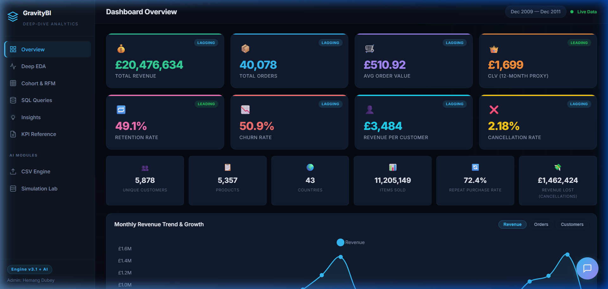
<br>
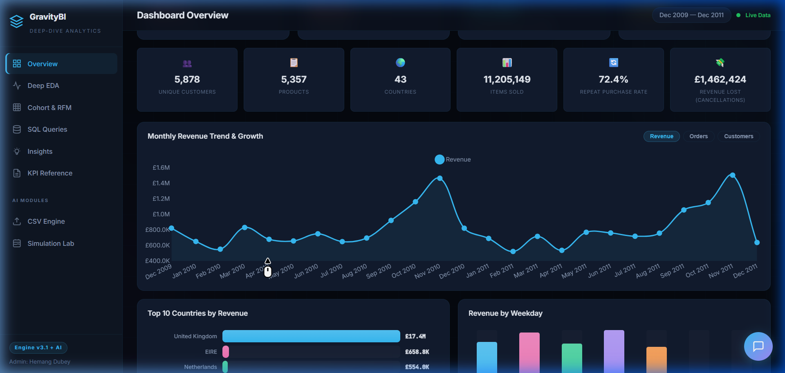
<br>
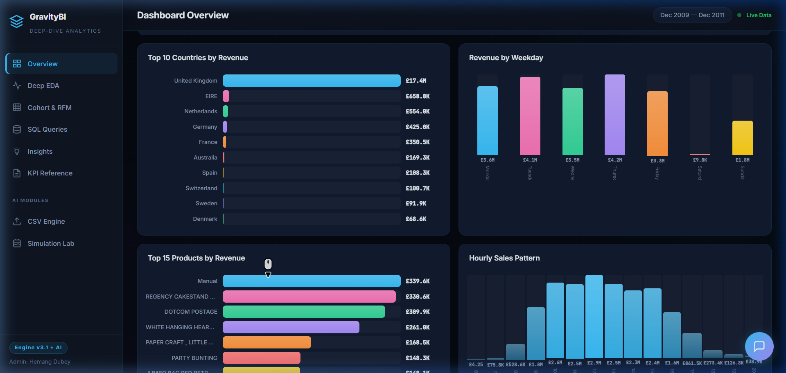
<br>
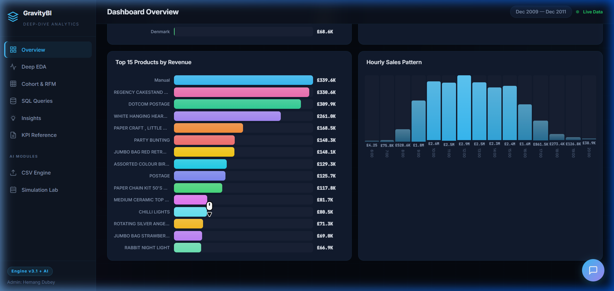

---

### 2. Deep EDA (Exploratory Data Analysis)
Focuses on the statistical distribution of the dataset, highlighting customer behavior patterns, identifying correlations between price and quantity, and running a Pareto analysis to observe the "80/20" rule in action.

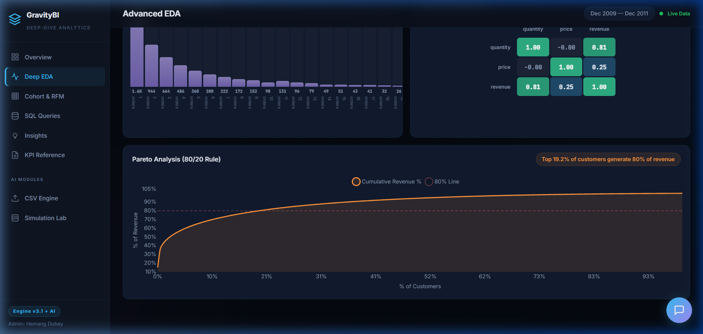

---

### 3. Customer Segmentation (Cohort & RFM)
Visualizes customer loyalty over time via a Cohort Retention Heatmap and categorizes the customer base into actionable RFM segments (Champions, At Risk, Hibernating, etc.) with specific strategic recommendations for each cluster.

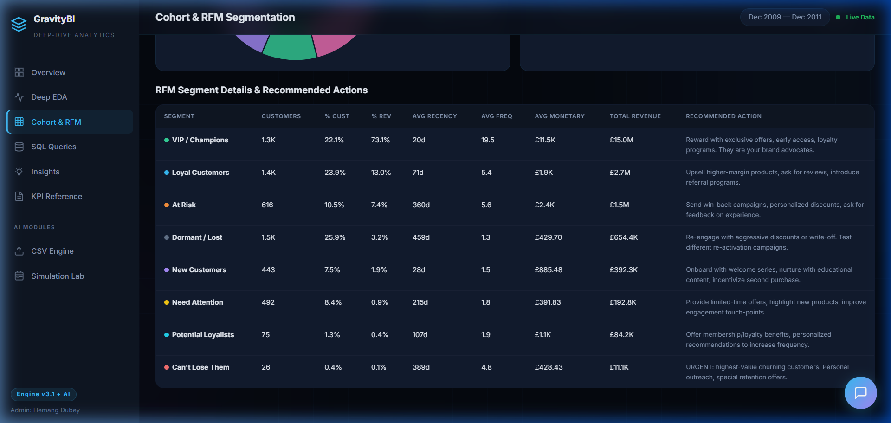

---

### 4. SQL Business Intelligence Queries
10 complex SQL queries (using CTEs, Window Functions, and CASE statements) used during the data transformation process, rendered elegantly in the UI with their corresponding outputs.

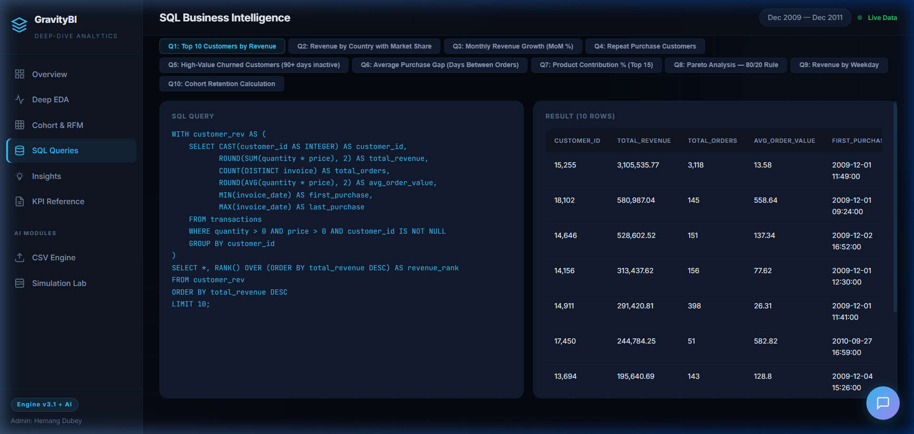

---

### 5. Strategic Insights
Executive-level summaries detailing specific opportunities and risks uncovered within the dataset. Actionable recommendations are broken down into Revenue Growth, Cost Optimization, and Operational Risk.

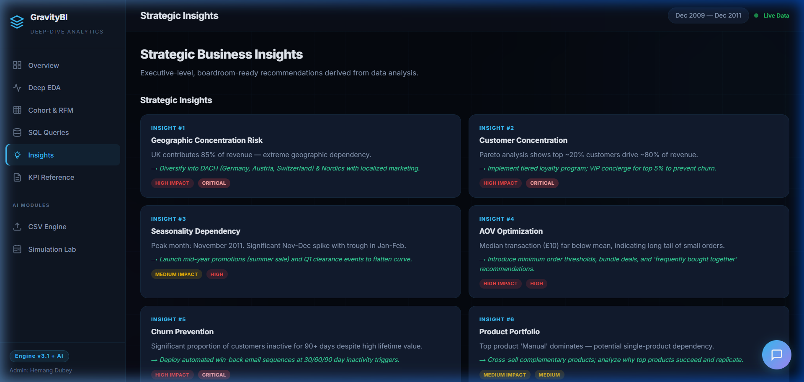

---

### 6. 🧪 Business Simulation Lab (AI Module)
A dynamic forecasting tool allowing users to tweak baseline business parameters. The simulation engine calculates compounding impacts over a 12-month period, offering visual "Before vs. After" analysis alongside auto-generated AI recommendations.

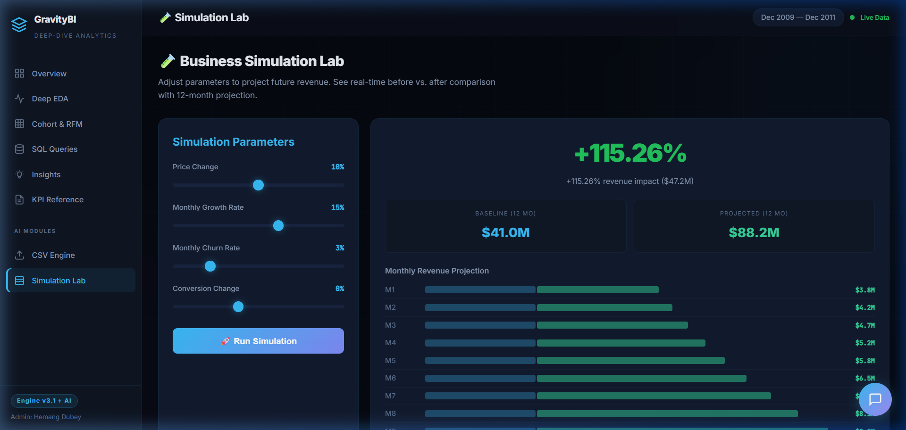

---

### 7. 📁 Dynamic CSV Engine (AI Module)
Allows arbitrary `.csv` file uploads. A built-in schema-detection engine interprets column data types (numerical, categorical, temporal) on-the-fly and auto-assembles a new, bespoke dashboard without developer intervention.

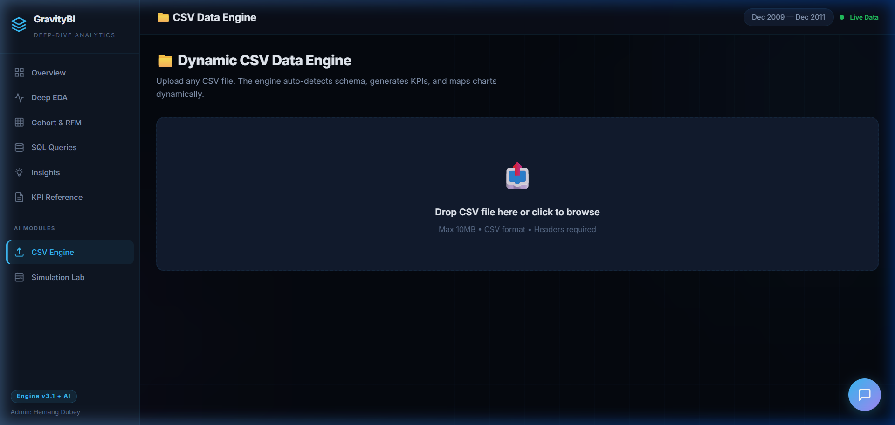

---

### 8. 🍯 H.O.N.E.Y AI Business Assistant (AI Module)
A floating chat interface powered by Groq's high-speed Llama 3 API. The chatbot inherits context from the currently active dataset to provide mathematically grounded answers regarding the specific KPIs and underlying data.

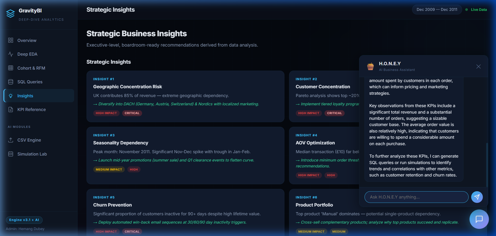

---

## 🛠️ Technology Stack
*   **Data Processing (Backend Analysis):** Python (Pandas, Numpy) *(`task3_analytics_engine.py`)*
*   **Frontend UI:** Vanilla HTML5, CSS3 (Custom Glassmorphism Design System), JavaScript (ES6+).
*   **Charting Libraries:** HTML/CSS dynamic bars (for reliability & custom design) & Chart.js (for time-series lines and pies).
*   **Backend Serving (Simulation & AI):** Node.js and Express.js.
*   **AI Integration:** Groq SDK for ultra-fast LLM inference.
*   **CSV Processing:** PapaParse (Client-side dynamic parsing).

## 🚀 How to Run Locally

1. Make sure you have **Node.js** installed on your system.
2. Clone the repository and navigate to the Task 3 directory:
   ```bash
   cd Task-3-DeepDive-Interactive-Dashboard
   ```
3. Install the minimal Node dependencies:
   ```bash
   npm install
   ```
4. Set up the Environment Variables:
   Create a `.env` file in the root of the task directory and add your Groq API key:
   ```env
   PORT=8765
   GROQ_API_KEY=your_groq_api_key_here
   ```
5. Start the Application Server:
   ```bash
   node server.js
   ```
6. Open your browser and navigate to:
   http://localhost:8765/dashboard.html

---
*Developed as part of the Apex Planet Data Analytics Internship.*
